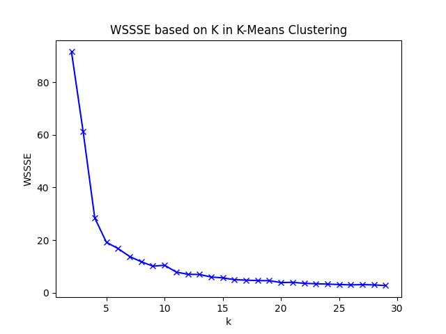
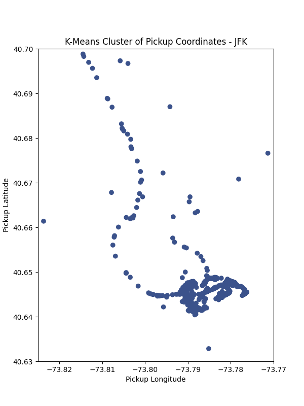
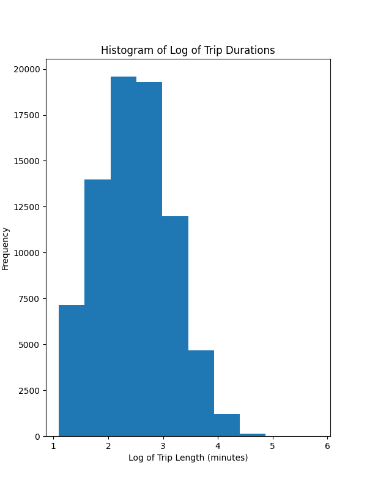
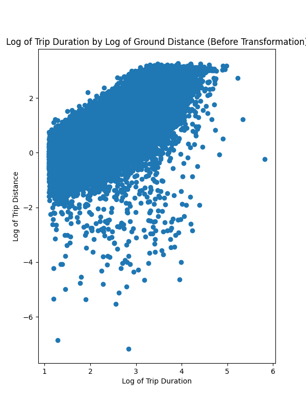

# Data Engineering 300 - Homework 2
### Name: Garrett Lee
### Date: May 17, 2023

## Commands to Run Docker
docker build -t project:0.1 . <br>
docker run -v "$(pwd)/data":/tmp/data project:0.1

## Answers to Questions
2 - To add weather conditions for the pickup times, I assumed that the weather does not change from the previous top of the hour (e.g., weather at 12:59pm will follow the weather listed for 12pm).

3a - If I look at the WSSSE visualization to use the elbow method to find the best k, such value is 5. The note here is that even though there is a sharp decrease in the WSSSE for k=4, there is substantial decrease of the error gained from k=4 to k=5, which prompted the choice of k for the latter. k=5 yielded a silhouette score of 0.60. <br>
 <br>
```The silhouette score when k=5 is 0.60.```

3b - The figure representing the clusters is below: <br>


3c-i - (*Note: I had to filter some points in the cluster out to zoom in to the LaGuardia Airport since some points were too far away from the airport to be considered as originating at the airport*.) By zooming in the trips originating from LaGuardia Airport (approximately 40.75-40.78 north and 73.850-73.885 west), we realize that there is a group of trips originating from the Grand Central Parkway (the road right in front of the entrance to the airport). Outside of it, there is also some calls for taxi on 23rd Avenue and 94th Street, the section that intersects Grand Central Parkway. The LaGuardia Airport cluster has 2122 pick-up locations, the centroid coordinate of (40.77, -73.87), and the variance of 5.01e-06 latitude degrees and  2.06e-05 longitude degrees. (Reference: output.txt) <br>
```
The centroid of the LaGuardia cluster is ( 40.77,-73.87).
The LaGuardia cluster has 2122 points.
The LaGuardia cluster has a variance of  5.01e-06 latitude degrees and  2.06e-05 longitude degrees.
```
<br>


3c-ii - (*Note: I had to filter some points in the cluster out to zoom in to the JFK Airport since some points were too far away from the airport to be considered as originating at the airport*.) By zooming in the trips originating from JFK Airport (approximately 40.63-40.70 north and 73.77-73.825 west), we see a distinct curve line leading to the center of the cluster, which goes along the Van Wyck Expressway leading to the terminals. The expressway leading to the airport goes to the middle of the terminals, where the traffic breaks off to different terminals. Therefore, it is not surprising that (unlike LaGuardia) we see a complete oval shape for pick-up coordinates. The cluster has 1611 pick-up locations, the centroid coordinate of (40.65,-73.79), and the variance of 3.43e-06 latitude degrees and 2.06e-05 longitude degrees. (Reference: output.txt) <br>
```
The centroid of the JFK cluster is ( 40.65,-73.78).
The JFK cluster has 1530 points.
The JFK cluster has a variance of  3.43e-06 latitude degrees and  2.06e-05 longitude degrees.
``` 
<br>


3c-iii - Comparing the two outputs, it is clear that:
1. There are more taxi trips made in LaGuardia than that of JFK during the same time. This makes sense because JFK has more transit options while LaGuardia does not. 
2. The variance of the JFK cluster is slightly larger than that of LaGuardia. We could connect this to the fact that JFK has more terminals, leading the trip requests to be more spread out.
 
3d - The silhouette score for the dropoff coordinates is 0.51. (Reference: output.txt) <br>
```The silhouette score for the dropoff coordinates is: 0.51.``` 
<br>

4 - Intra-cluster trips: Zone 4 (lower parts of Midtown and upper parts of Lower Manhattan) seem to have many trips happening within the area. The next cluster that follows is lower Manhattan and lower Brooklyn (Zone 2), which makes sense since there is a lot of activity happening within the area, including the financial area. Interestingly, there does not seem to be many intra-cluster trips on the east side. This might support the hypothesis that most taxi users are using the service to get to Manhattan for commuting. <br>
```
Intra-cluster pickup-dropoff trips: 
4-4	16926
2-2	11259
0-0	9738
3-3	394
1-1	146
```
<br>
Excluding the intra-cluster trips (Zones 0, 2, and 4 are the top three), the trips happening between these three zones seem to take a high proportion. Therefore, we can conclude that trips in Brooklyn and Manhattan dominate. It nmight be interesting to design more clusters and see if this trend can be observed only for the Manhattan island. 

```
All pickup-dropoff trips: 
4-4	16926
2-2	11259
0-0	9738
4-2	8073
2-4	7654
4-0	7531
0-4	6361
2-0	2017
0-2	1427
4-3	1030
3-4	955
3-2	643
1-2	520
3-0	501
0-3	494
1-4	493
2-3	480
4-1	405
3-3	394
1-0	258
1-3	209
2-1	189
0-1	146
1-1	146
3-1	73
``` 
<br>

5-i - The distribution of the logarithm of trip durations looks roughly normally distributed, but it seems to be slighly right-tailed. The center seems to be at around 2.5 logarithm units. <br>


5-ii - By inspecting the graph, We observe a small gradual decrease in the number of trips throughout the month, but that trend is not too obvious.  <br>


6-i - On average, we observe longer trips during Wednesday, Thursday, and Friday, as seen by the logarithm of trip length. On the other hand, the trips lengths for Saturday, Sunday, and Monday is less on average. The lower trip lengths on weekends might suggest the claim that people are likely to travel long distances using other modes of transit such as train or bus since they have more time. 
<br>
```
Statistics for Each Day of the Week Trip Durations:
Category, Average, Maximum, Minimum, Median, Variance
Row(day_of_week='Wednesday', avg_duration='2.543', max_duration='5.333', min_duration='1.099', median_duration='2.539', variance='0.468')
Row(day_of_week='Tuesday', avg_duration='2.483', max_duration='5.816', min_duration='1.099', median_duration='2.478', variance='0.434')
Row(day_of_week='Friday', avg_duration='2.510', max_duration='4.946', min_duration='1.099', median_duration='2.507', variance='0.449')
Row(day_of_week='Thursday', avg_duration='2.536', max_duration='4.979', min_duration='1.099', median_duration='2.534', variance='0.453')
Row(day_of_week='Saturday', avg_duration='2.419', max_duration='4.614', min_duration='1.099', median_duration='2.413', variance='0.393')
Row(day_of_week='Monday', avg_duration='2.442', max_duration='4.900', min_duration='1.099', median_duration='2.422', variance='0.436')
Row(day_of_week='Sunday', avg_duration='2.404', max_duration='4.703', min_duration='1.099', median_duration='2.381', variance='0.425')
```
<br>

6-ii - There seems to be more spread and higher trip durations on weekdays. This may be caused by the morning and evening rush-hours when many commuters are going to and from their workplace.  <br>
```
Statistics for Weekday or Weekend Trip Durations:
Category, Average, Maximum, Minimum, Median, Variance
Row(weekday_or_weekend='Weekday', avg_duration='2.508', max_duration='5.816', min_duration='1.099', median_duration='2.500', variance='0.451')
Row(weekday_or_weekend='Weekend', avg_duration='2.412', max_duration='4.703', min_duration='1.099', median_duration='2.399', variance='0.408')
```
<br>

6-iii - Looking at the outputs, we observe that the afternoon trips tend to take the longest on average and the most variance. This is an interesting finding, since the afternoon trips are between 12-5 PM, which only includes very early evening trips back home. This does not shed much insight to the original intuition that morning rush trips have the longest trips. <br>
```
Statistics for Part of Day Trip Durations:
Category, Average, Maximum, Minimum, Median, Variance
Row(part_of_day='Evening', avg_duration='2.481', max_duration='5.816', min_duration='1.099', median_duration='2.461', variance='0.448')
Row(part_of_day='Morning', avg_duration='2.463', max_duration='4.946', min_duration='1.099', median_duration='2.454', variance='0.430')
Row(part_of_day='Afternoon', avg_duration='2.588', max_duration='5.333', min_duration='1.099', median_duration='2.580', variance='0.502')
Row(part_of_day='Night', avg_duration='2.419', max_duration='4.492', min_duration='1.099', median_duration='2.420', variance='0.384')
``` 
<br>

6-iv - To identify whether morning rush trips take longer, I separated the entries using a binary filter: whether the trip was during the morning rush time or not. The results indicate that longer trips are made during the morning rush, but with only 0.02 logarithm units. <br>
```
Statistics for Weekday Rush or Not Trip Durations:
Category, Average, Maximum, Minimum, Median, Variance
Row(weekday_rush_or_not='No', avg_duration='2.480', max_duration='5.816', min_duration='1.099', median_duration='2.468', variance='0.444')
Row(weekday_rush_or_not='Yes', avg_duration='2.500', max_duration='4.946', min_duration='1.099', median_duration='2.495', variance='0.434')
```
<br>

7b - The linear asymptote in the graph most likely represents the upper limit as to how fast a taxi can go. Any point that is below that line represents a taxi trip that was not efficient, since the vehicle experienced delays or travelled not as fast as the vehicle can. <br>


7c - Since the distribution of the log of the ground distance is not skewed (skewed statistics of 0.151), so we will keep the logarithm transformation for future use. (Reference: output.txt) <br>
```
Skewness of log_distance: 0.1510571979850982
```
<br>

8a - Here, we need to convert the categorical variables into numerical ones so that the regression can be done. I will use one hot encoding for the day_of_week and part_of_day columns, because there is no ascending or descending trend that is associated with each category in the two variables. Each category has its own characteristics, so the regression will benefit if there are separate attributes representing each. I additionally chose to include temperature, pressure, and precipitation because I suspected that they will influence the trip duration. I chose not to include other columns, since I suspected that they will not impact the trip duration (e.g., for the number of passengers, I think that having more passengers does not make the trip longer or shorter. The distance of travel should still be the same).

8b - The Test RSME is 0.429, MAE 0.330, and the R-squared is 0.578. (Reference: output.txt) <br>
```
Linear Regression Model RMSE: 0.429
Linear Regression Model MAE: 0.330
Linear Regression Model R2: 0.578
```
<br>

8c - The Test RSME is 0.400, MAE 0.314, and the R-squared is 0.633. Log_distance (importance statistic of 0.919) seems to be significantly important, while all other features are practically unimportant. The next important features after the logarithm of distance is the indicator variable for night trips (0.0176), the indicator variable for afternoon trips (0.0147), temperature (0.0106), and pressure (0.0105). Since the trip distance clearly dominates the trip duration (which is intuitive), the next question should be trying to predict the trip duration without the distance information. (Reference: output.txt) <br>
```
Random Forest Model RMSE: 0.400
Random Forest Model MAE: 0.314
Random Forest Model R2: 0.633
Feature Importances for the Random Forest Model:
log_distance: 0.919
at_night: 0.018
at_afternoon: 0.015
Temp: 0.011
Pressure: 0.011
on_sunday: 0.007
on_saturday: 0.005
at_morning: 0.003
on_wednesday: 0.003
at_evening: 0.003
Precip: 0.002
on_thursday: 0.002
on_monday: 0.002
on_friday: 0.001
on_tuesday: 0.001
```
